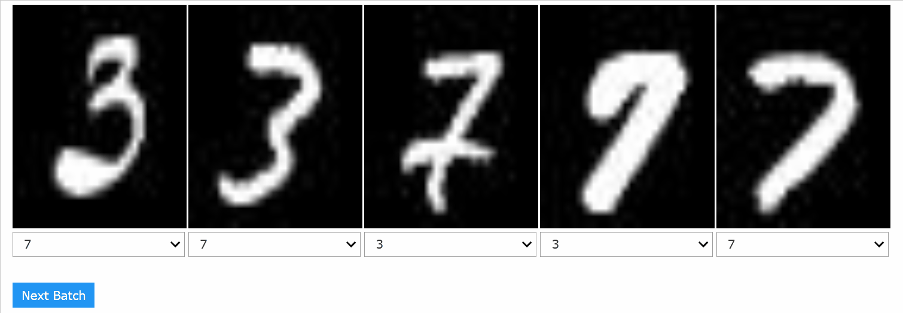

# Fruit Classifier Web App

This repo is the code base for the web app version of a deep learning model I created using the [fast.ai](https://www.fast.ai) library. Upload an image of any of the listed fruits on the webpage below and let it tell you what fruit you uploaded. Try it out and let me know how it goes!

The webpage can be accessed [here](https://eli-fruit-classifier.herokuapp.com).

I will discuss how I created and cleaned the data set in this ReadMe. The notebook contains more details about how I trained the model.

I used the fastai_v1 library. The newest version of the library will be released sometime in August 2020 I believe, along with an updated course (the one listed below is the 2019 version which used the fastai_v1 library).

I trained the model using the ResNet50 model with a dataset I created from Google images (taught in the fastai course linked below). I used around 300 images per category, with an 80/20 split of training/validation sets. No test set was created at the moment, although I may create one at a later date. I cleaned a large portion of the data myself using a tool from the fast.ai library, but not all of it. I may clean it further later on.

Check out the [Practical Deep Learning for Coders](https://course.fast.ai/) course by fast.ai that taught me how to create the model!

To make the website I used the [Streamlit](https://www.streamlit.io/) library for Python. The library is really simple to use and allows for rapid deployment of data models in a clean format. I'm currently hosting the website with [Heroku](https://www.heroku.com/).

## How I Made the Data Set

First off, I really recommend checking out the course linked above, or at least their notebook that explains this entire process. You can access the notebook [here](https://github.com/fastai/course-v3/blob/master/nbs/dl1/lesson2-download.ipynb). I'm just giving a brief explanation from what I've learned from their course.

The fast.ai course above showed how to create a data set from google images, which is what I used to create my fruit data set.

To do this, search for the image you want in google images, and scroll as far as you can, clicking see more, until you reach the bottom. Then right-click in the browser, select inspect element, and go to the console tab. Then copy, paste and run the following code:

```js
urls = Array.from(document.querySelectorAll(".rg_i")).map((el) =>
  el.hasAttribute("data-src")
    ? el.getAttribute("data-src")
    : el.getAttribute("data-iurl")
);
window.open("data:text/csv;charset=utf-8," + escape(urls.join("\n")));
```

Once you run this it will collect all the urls to the images able to be viewed and save them to your computer.

Now it's time to use fastai.

They have a function called download_images() which takes the file of image urls and download each image into the directory of your choice. You can also tell the function the max number of images you would like to download, and it'll only download the first 'n' images. For example, I used 300 images per fruit before cleaning.

And that's it. Now you have a completely organized image data set that you created.

## How I Cleaned the Data

To clean the data I used a widget by fastai. I'll show some images of the widget below, but they aren't of my data set. To see how to setup the widget, checout the notebook I mentioned in the section above.

Once the widget is setup, it will start showing images it had the most trouble with when training (I think this is how it works, but I'm not 100% sure). It'll look something like this:



The gif was take from the fastai docs, but if you're using an updated version of fastai_v1, there should be an option to delete the picture altogether.

The widget will place the relative path to each of the images in a file called cleaned.csv. It should update every time you click 'Next Batch', so you'll still have a cleaner data set than before even if you have to stop part way through.

That's it. After seeing images that all look like they're correctly classified in a row, you can probably stop cleaning the data. This goes back to the widget taking the images from the ones that had the highest loss when training.

Thanks for taking a look at my classifier! I really enjoyed making this, so if you like it, have any tips, or want to work on something together, let me know!
